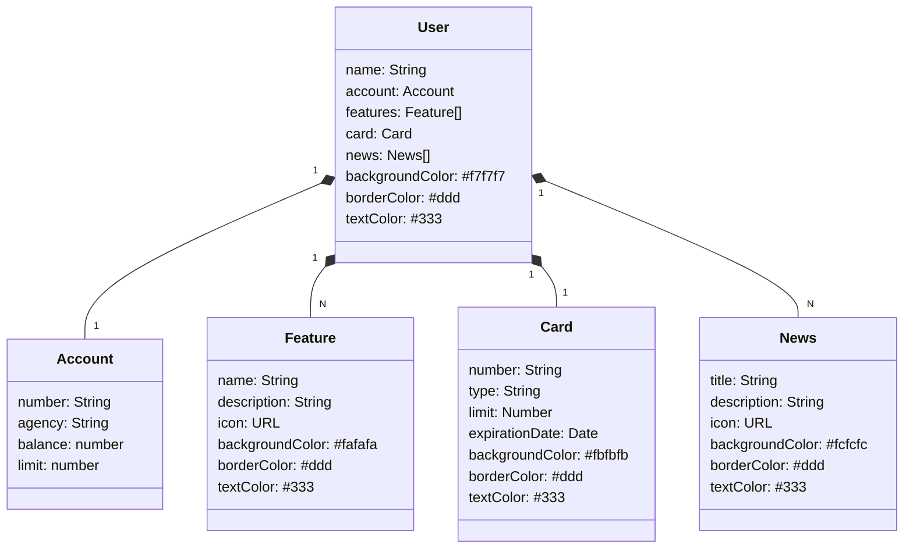

# Santander Dev Week

## Diagrama de classes

```mermaid
classDiagram
class User {
  name: String
  account: Account
  features: Feature[]
  card: Card
  news: News[]

  backgroundColor: #f7f7f7
  borderColor: #ddd
  textColor: #333
}

class Account {
  number: String
  agency: String
  balance: number
  limit: number
}

class Feature {
  name: String
  description: String
  icon: URL

  backgroundColor: #fafafa
  borderColor: #ddd
  textColor: #333
}

class Card {
  number: String
  type: String
  limit: Number
  expirationDate: Date

  backgroundColor: #fbfbfb
  borderColor: #ddd
  textColor: #333
}

class News {
  title: String
  description: String
  icon: URL

  backgroundColor: #fcfcfc
  borderColor: #ddd
  textColor: #333
}


User "1" *-- "1" Account
User "1" *-- "N" Feature
User "1" *-- "1" Card
User "1" *-- "N" News
```
